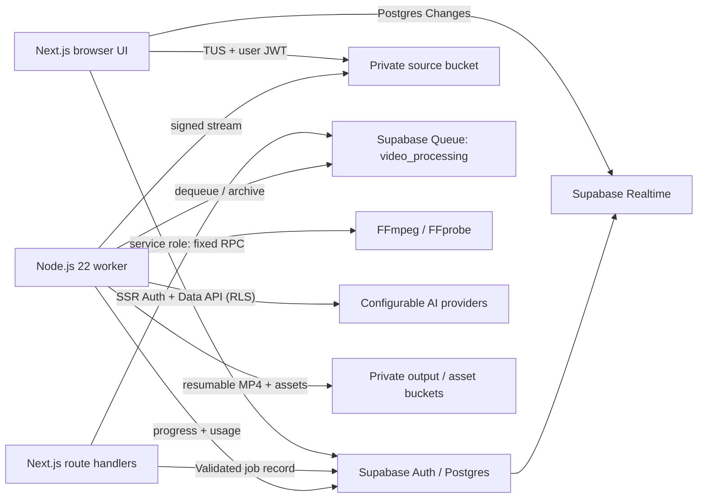

# Editing App

Editing App is a production-oriented creative suite built with Next.js 16, React 19, TypeScript, Tailwind CSS, shadcn/ui, Supabase, FFmpeg, and a separate containerized Node.js 22 worker. It combines long-form video editing with model-routed AI image and video generation in one private workspace.

The application is not a client-side mock. Source videos are uploaded directly to private Supabase Storage with resumable TUS uploads, jobs are persisted in Supabase Queues, FFmpeg runs in the worker container, and job progress reaches the editor through Supabase Realtime.

## What works

- Supabase email/password authentication with SSR cookie refresh
- Private, resumable video uploads with a fixed 6 MiB TUS chunk size
- File-size, MIME-type, ownership, and upload-completion validation
- Project dashboard, history, signed previews, deletion, and export downloads
- FFprobe media inspection and FFmpeg scene and silence detection
- Automatic fal.ai routing plus pluggable timestamped transcription and content-analysis providers
- Transcript, automatic captions, filler-word suggestions, and highlight suggestions
- Trim ranges, optional silence/filler removal, volume, mute, and noise reduction
- Original, TikTok/Reels 9:16, Instagram square, and YouTube 16:9 output
- Styled burned-in captions and H.264/AAC fast-start MP4 exports
- Durable retryable processing with Realtime progress and structured logs
- Usage events, database-backed rate limits, RLS, explicit grants, tests, and Docker images

The planned advertising, standalone image generation, clipping, voiceover, caption-removal, and background-removal products are intentionally not implemented.

## Architecture



Heavy media work never runs in a Next.js request or an Edge Function. The web process only validates requests, creates records, and submits small queue messages. The worker downloads to a dedicated temporary root, streams the result back with TUS, and deletes the job directory in `finally`; stale directories are removed on worker startup.

The default Next.js build uses native platform output for Vercel. The web Dockerfile sets `NEXT_OUTPUT=standalone` only inside its builder stage so the container can copy `.next/standalone` without forcing Vercel through the self-hosting artifact path.

## Prerequisites

- Node.js 22 or newer
- Docker with Compose (recommended for the worker and local Supabase)
- Supabase CLI (installed as a project dev dependency)
- A hosted Supabase project or the local Supabase stack
- FFmpeg and FFprobe only when running the worker outside Docker

## Setup

1. Install packages and create the environment file:

   ```bash
   npm install --include=dev
   cp .env.example .env
   ```

   On Windows PowerShell, use `Copy-Item .env.example .env`.

2. Create or start Supabase. For local development:

   ```bash
   npm run db:start
   npm run db:reset
   npm run db:types
   ```

   For a hosted project, link it and apply the checked-in migration:

   ```bash
   npx supabase link --project-ref YOUR_PROJECT_REF
   npx supabase db push
   npx supabase gen types typescript --linked --schema public > src/types/database.generated.ts
   ```

3. Copy the project URL, publishable key, and server-only secret/service-role key into `.env`. Never prefix a secret or service-role key with `NEXT_PUBLIC_`. Set the Auth site URL and allowed redirect URL to your application origin; confirmation links return through `/auth/confirm`.

4. Select AI adapters. The default `auto` mode uses fal.ai when `FAL_KEY` is present, then an explicitly configured OpenAI-compatible key, and finally the deterministic local fallback. One worker-only Fal key enables timestamped Whisper transcription and LLM-based filler/highlight analysis:

   ```dotenv
   FAL_KEY=your_server_only_fal_key
   FAL_ROUTING_PROFILE=balanced
   TRANSCRIPTION_PROVIDER=auto
   CONTENT_ANALYSIS_PROVIDER=auto
   ```

   Fal input audio is uploaded with a one-hour lifecycle, Whisper returns word timestamps for captions, and analysis runs through Fal's current `openrouter/router` endpoint. Provider keys are loaded only by the worker. `local` content analysis remains available without a network call; `local` transcription intentionally produces an empty transcript.

### Automatic fal.ai model routing

`worker/providers/fal/routing.ts` is the central capability registry. A future feature asks for a capability such as `text-to-video`, `image-to-video`, `text-to-image`, `voiceover`, `caption-removal`, or `background-removal`; the router scores only schema-compatible candidates for the selected `quality`, `balanced`, `speed`, or `cost` profile. This keeps routing automatic and auditable without sending an unvalidated payload to an arbitrary model.

Operations can replace a route immediately without a code deployment:

```dotenv
FAL_ROUTING_PROFILE=quality
FAL_MODEL_OVERRIDES={"text-to-video":"fal-ai/veo3.1/fast","content-analysis":{"endpointId":"openrouter/router","model":"google/gemini-2.5-flash"}}
```

Overrides are validated at worker startup. When adding a feature, add its request/response adapter and call `resolveFalModel` with the feature capability; do not call Fal from a browser component or a Next.js request. Long-running media work remains in the durable worker pipeline.

5. Run the web app and worker in separate terminals:

   ```bash
   npm run dev
   npm run worker
   ```

   Or run the production-shaped services together:

   ```bash
   docker compose up --build
   ```

Open [http://localhost:3000](http://localhost:3000), create an account, and upload a supported video. The upload automatically enqueues analysis after TUS reports success.

## Database and security

The migration at `supabase/migrations/20260807115631_create_video_platform.sql` creates the complete schema, private buckets, queue, indexes, triggers, functions, grants, and policies.

- Every application table has RLS enabled and ownership policies for all CRUD operations.
- Authenticated Data API access is explicitly granted. Users can mutate their own profiles/projects and can only read job, usage, and rate-limit records; trusted job/usage mutations use server-only credentials.
- The atomic rate-limit function is a narrowly granted `SECURITY DEFINER` function that derives ownership from `auth.uid()`. Users cannot reset counters directly.
- Storage policies require the first object-path segment to equal the authenticated user ID.
- Buckets are private. The application issues short-lived signed URLs after an RLS-protected project lookup.
- The queue name is fixed inside server-side RPC wrappers, and only the service role can enqueue, dequeue, or archive messages.
- One partial unique index prevents concurrent active jobs of the same kind for one project.
- Secret values are redacted from structured application and worker logs.

The source bucket accepts MP4, MOV, WebM, and Matroska up to 2 GiB. The output bucket accepts MP4 up to 4 GiB. These limits are enforced by Storage metadata and the application validation layer.

## Reliability and operations

- Queue messages become visible again after `WORKER_VISIBILITY_TIMEOUT_SECONDS` if a worker dies.
- Jobs retry up to `jobs.max_attempts` and preserve a safe error summary for the UI.
- Completed, cancelled, malformed, or exhausted messages are archived.
- A worker processes one video at a time by design. Scale horizontally for concurrency; keep only one worker per CPU/IO allocation.
- Give `WORKER_TEMP_ROOT` enough ephemeral disk for both the source and rendered output. The Compose service uses a 10 GiB `tmpfs`.
- Set the queue visibility timeout above the longest expected render. Very long productions should increase it from the 30-minute example value.
- The health endpoint is `/api/health`. Container logs are newline-delimited JSON.
- Rotate Supabase and AI credentials through your deployment secret manager. Rebuild the web image if browser-safe Supabase values change because they are compiled into the client bundle.

### Vercel and worker environment separation

The Vercel web deployment needs the three `NEXT_PUBLIC_*` values, `SUPABASE_SERVICE_ROLE_KEY`, `MAX_UPLOAD_BYTES`, `SIGNED_URL_TTL_SECONDS`, `NEXT_SERVER_ACTIONS_ENCRYPTION_KEY`, and `DEPLOYMENT_VERSION`. `FAL_KEY`, `FAL_ROUTING_PROFILE`, `FAL_MODEL_OVERRIDES`, the `WORKER_SUPABASE_*` credentials, FFmpeg paths, and worker timing settings belong on the separate worker service. If the worker is deployed through Vercel Services, scope those variables to that service; otherwise do not add `FAL_KEY` to the web project at all.

## Validation commands

```bash
npm run lint
npm run typecheck
npm test
npm run build
npm run db:lint
npm run db:test
```

`db:lint`, `db:reset`, type generation from local Supabase, and container integration tests require Docker. Unit tests cover input schemas, timestamp-safe cuts/captions, FFmpeg planning, and local analysis.

## Repository map

- `src/app` — App Router pages, authentication callback, and narrow route handlers
- `src/components/video-editor.tsx` — responsive editor and Realtime job state
- `src/lib/supabase` — browser, server, admin, and proxy clients
- `src/lib/domain/video.ts` — shared limits, schemas, settings, and queue contract
- `worker` — queue runner, AI adapters, FFmpeg pipeline, Storage streaming, and cleanup
- `supabase/migrations` — SQL schema, RLS, grants, Storage, Realtime, and queue setup
- `src/types/database.generated.ts` — generated Supabase database contract
- `Dockerfile`, `worker/Dockerfile`, `docker-compose.yml` — isolated web and media worker services

## Production checklist

- Use a dedicated hosted Supabase project and apply migrations in CI before deployment.
- Regenerate and review database types after every migration.
- Configure SMTP, email confirmation, CAPTCHA, and appropriate Supabase Auth rate limits.
- Put the web and worker behind separate deployment identities; only those server workloads receive secret keys.
- Provide persistent logs/metrics, worker CPU and memory limits, alerts for failed jobs, and Storage lifecycle rules for exports your product no longer needs.
- Confirm FFmpeg codec licensing and AI-provider data-processing terms for your deployment.
